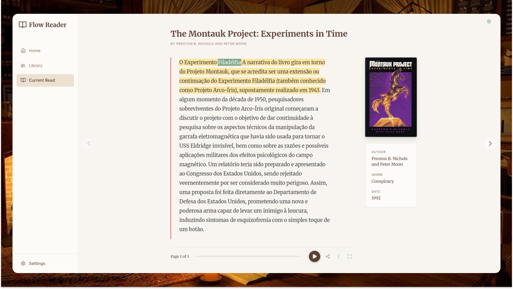

# Flow Read



A modern, distraction-free web reader featuring high-quality text-to-speech synthesis and a Kindle-inspired interface, built with **React**, **Bun**, and **TypeScript**.

## 🚀 Stack

- **Monorepo Manager**: [pnpm workspaces](https://pnpm.io/workspaces)
- **Backend**: [Bun](https://bun.sh) (Fast JavaScript runtime)
- **Frontend**: [React](https://react.dev) + [Vite](https://vitejs.dev)
- **Shared**: Shared utility library
- **Architecture**: Domain-Driven Design (DDD) / Clean Architecture principles

## 📋 Prerequisites

Before you begin, ensure you have the following installed:

- **[Node.js](https://nodejs.org/)** (v18 or higher)
- **[pnpm](https://pnpm.io/)** (v8 or higher) - Used for package management
- **[Bun](https://bun.sh/)** (v1.0 or higher) - Required for the backend runtime

## 🛠️ Getting Started

1.  **Install Dependencies**

    ```bash
    pnpm install
    ```

2.  **Run Development Server**
    Start both backend (watch mode) and frontend (HMR) in parallel:

    ```bash
    pnpm dev
    ```

    - Frontend: `http://localhost:5173`
    - Backend: `http://localhost:3000`

## 📦 Scripts

### Production

Build and run the optimized production application (Backend on port 4000):

```bash
pnpm clean:all
pnpm build
pnpm prod
```

### Testing

Run unit tests across all packages:

```bash
pnpm test
```

### Maintenance

- **Clean Artifacts** (`dist`, `coverage`):
  ```bash
  pnpm clean:all
  ```
- **Full Reset** (Nuke `node_modules` and artifacts):
  ```bash
  pnpm nuke
  ```

## 📂 Structure

```
├── packages/
│   ├── backend/    # Bun HTTP Server (Clean Arch)
│   ├── frontend/   # React + Vite Application
│   └── shared/     # Shared Types & Utilities
├── package.json    # Root scripts
└── pnpm-workspace.yaml
```

## 📝 Configuration

- **Backend Port**: Configurable via `PORT` env var (Default: 3000, Prod: 4000).
- **Frontend API URL**: Configurable via `VITE_API_URL`.
